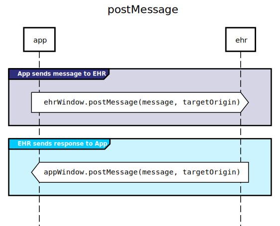

{::comment}

  COMMON TERMS, which will reveal a hover-text definition in the IG when viewed.
  
  NOTE: When adding an abbreviation to this list, also add the same abbreviation
  to the List of Abbreviations section near the end of this IG.

{:/comment}
*[API]: Application Programming Interface
*[CDS]: Clinical Decision Support
*[CPOE]: Computerized Physician Order Entry
*[CRUD]: Create Read Update Delete
*[EHR]: Electronic Health Record
*[EHRs]: Electronic Health Record
*[OAuth]: An open standard for access delegation, commonly used as a way for Internet users to grant websites or applications access to their information on other websites but without giving them the passwords.
*[UX]: User Experience

{::comment}

  LINKS, which enable the markdown to simply reference [link name] for short.

{:/comment}
[Activity Catalog]: ./activity-catalog.html
[Alternatives Considered]: ./alternatives-considered.html
[`Bundle.entry.response`]: https://hl7.org/fhir/bundle-definitions.html#Bundle.entry.response.location
[CDS Hooks]: https://cds-hooks.hl7.org/1.0
[CDS Hooks Action]: https://cds-hooks.hl7.org/1.0/#action
[FHIR]: https://hl7.org/fhir/
[FHIR Coding]: https://www.hl7.org/fhir/datatypes.html#Coding
[FHIR CodeableConcept]: https://hl7.org/fhir/datatypes.html#CodeableConcept
[FHIR OperationOutcome]: https://www.hl7.org/fhir/operationoutcome.html
[FHIRCast]: https://fhircast.org
[HTML5]: https://html.spec.whatwg.org/multipage
[HTML5's Web Messaging]: https://html.spec.whatwg.org/multipage/web-messaging.html
[JSON (RFC7159)]: https://tools.ietf.org/html/rfc7159
[`MessageEvent`]: https://html.spec.whatwg.org/multipage/comms.html#messageevent
[OAuth]: https://oauth.net/
[OAuth 2.0]: https://oauth.net/2/
[OAuth scopes]: https://oauth.net/2/scope/
[RESTful FHIR API]: https://hl7.org/fhir/http.html
[RFC2119]: https://tools.ietf.org/html/rfc2119
[SMART applications]: https://hl7.org/fhir/smart-app-launch/index.html
[`window.postMessage`]: https://html.spec.whatwg.org/multipage/web-messaging.html#posting-messages

SMART Web Messaging enables tight UI integration between EHRs and embedded SMART apps via [HTML5's Web Messaging].  SMART Web Messaging allows applications to push unsigned orders, note snippets, risk scores, or UI suggestions directly to the clinician's EHR session.  Built on the browser's javascript [`window.postMessage`] function, SMART Web Messaging is a simple, native API for health apps embedded within the user's workflow.

### Underlying Standards

* [FHIR] 
* [CDS Hooks]
* [JSON (RFC7159)]
* [HTML5]

SMART Web Messaging is designed for compatibility with FHIR R4 and above.

### Why
Clinical workflow systems (such as EHRs) may be able to launch [SMART applications] in a few different ways: automatically at specific points in the workflow, by user interaction in the UI, or in response to a suggestion from a [CDS Hooks Service](https://cds-hooks.hl7.org/1.0/#cds-hooks-anatomy) (or *other* decision support service).  Once launched, web applications are often embedded within an iframe of the main UI.  In this model, the new application appears in close proximity to a patient's chart and can work with the EHR via [RESTful FHIR API].  These RESTful APIs are great for [CRUD](https://en.wikipedia.org/wiki/Create,_read,_update_and_delete) operations on a logical FHIR Server endpoint, but they don't enable tight workflow integration or access to draft FHIR resources that may only exist in memory on the EHR client.

For these embedded apps, there are some key use cases that SMART and CDS Hooks don't address today:

* Communicating a decision made by the clinician within the SMART app, such as:
  * placing an order
  * annotating a procedure with an appropriateness score or a radiation count
  * transmitting a textual note snippet
  * suggesting a diagnosis or a condition to the patient's chart
* Interrogating the orders scratchpad / shopping cart, currently only known within the ordering provider's [CPOE](https://en.wikipedia.org/wiki/Computerized_physician_order_entry) session.
* Allowing an app to communicate [UX](https://en.wikipedia.org/wiki/User_experience)-relevant results back to the EHR, for example, automatic navigation to a native EHR activity, or sending an "I'm done" signal.

Additionally, SMART Web Messaging enables other interesting capabilities.  For example:
* Saving app-specific session or state identifiers to the EHR for later retrieval (continuing sessions).
* Interacting with the EHR's FHIR server through this messaging channel (enabling applications that cannot access the FHIR server directly, e.g. those hosted on the internet).

### How
SMART Web Messaging builds on [HTML5's Web Messaging] specification, which allows web pages to communicate across domains. In JavaScript, calls to [`window.postMessage`] pass [`MessageEvent`] objects between windows.

  

